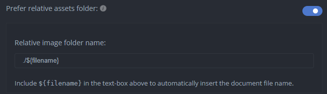
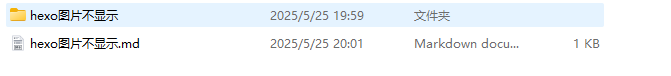

# 资源文件夹

hexo提供三种文件存放静态资源的方式

- 全局资源文件夹

- 文章资源文件夹

- 使用markdown嵌入文件（没用过）

> 官方文档： [资源文件夹 | Hexo](https://hexo.io/zh-cn/docs/asset-folders)

## 全局资源文件夹

如果你的文章中静态资源比较少，可以直接放在`source/images` 文件夹中，然后通过类似于 `` 的方法访问它们。

## 文章资源文件夹

        但是一般我们还是希望通过分类去管理我们的资源，把每一篇文章的资源都单独放在一个文件夹中存放，方便后期维护

        hexo也提供了更组织化的方式来管理资源。 这个稍微有些复杂但是管理资源非常方便的功能可以通过将 `config.yml` 文件中的 `post_asset_folder` 选项设为 `true` 来打开。

        这个是最坑的，当我们在配置文件中把post_asset_folder打开之后我们会发现我们的图片还是不能在网站上出现

        当我查阅大量文章之后，发现大部分文章都会让我们   `npm install hexo-asset-image -- save`，但是安装之后还是不行，主要是该命令安装的是插件 hexo-asset-image 1.0 ，这个版本有点问题，安装后图片不能正常显示（这里巨坑）

        我们需要使用下面这个命令安装

```
npm install https://github.com/xcodebuild/hexo-asset-image.git
```

        安装完成之后我们会发现我们的图片可以正常在web上显示了

## 使用markdown嵌入文件

        这个基本没有用过

# marktext

        我使用的markdown软件是marktext，主要是免费

       在使用这前我们需要配置一下这个软件

> flie -> preferences -> Image



我们需要把相对路径打开，并且将目录名改成`./${filename}`这样我们生成的图片就会在当前文件名所在文件下了


