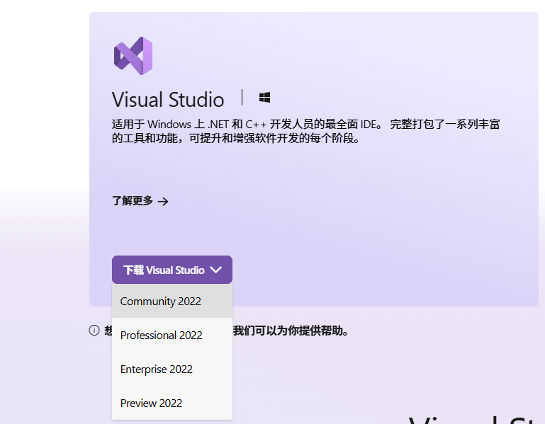
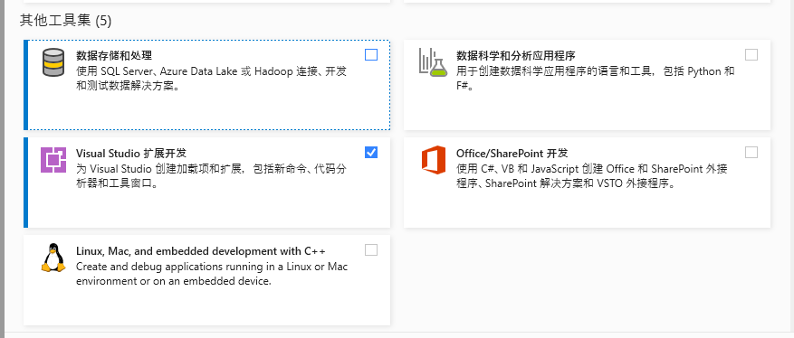
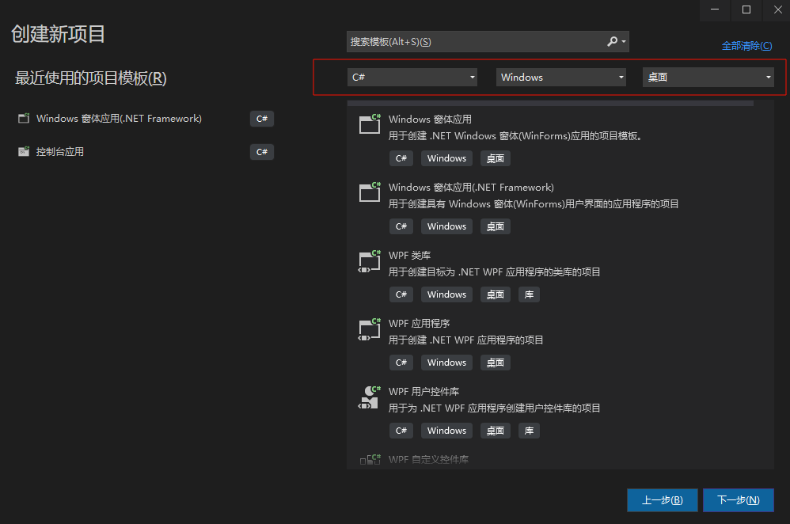
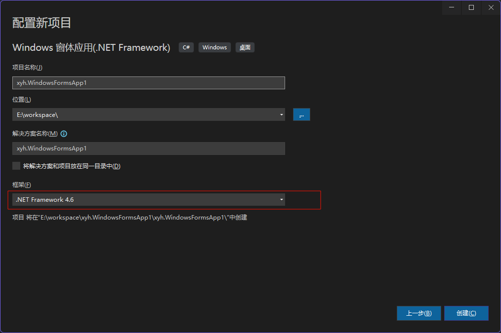

# 1.1vs2022开发环境安装及卸载

## 安装

官方网址： [Visual Studio: 面向软件开发人员和 Teams 的 IDE 和代码编辑器](https://visualstudio.microsoft.com/zh-hans/)

vs2022 community  我们使用免费版本的就可以了



在工作负载中我们选中




直接安装即可

## vs卸载

### 第一步找到安装器


### 第二步点击卸载


## vs修改

当我们发现有一些负载或者组件没有安装全，可以点击修改，重新安装


# 1.2 vs2022离线安装包制作过程

# 1.3 开发软件的介绍和相关设置

### 创建项目


通过筛选可以快速找到我们需要的模板




windows窗体应用：比较新，支持跨平台

.NET Framework :  只支持windows

> 如果没有跨平台的需求的话我们一般选.NET Framework就可以了

    

框架的话我们选择一个4.6版本就可以，如果没有这个版本可以在前面的vs组件中添加上

# 1.4 创建新项目及项目整体结构


解决方案相当于载体，我们的项目都需要在解决方案中，一个解决方案可以有多个项目


一个解决方案中可以有多个项目但是只有一个是启动项目，可运行的项目

当然我们也可以修改，将第二个项目变成启动项目


每一个项目都是一个文件夹，被一个解决方案管理

### 一个winFrom基本结构


Properties : 整个项目的属性配置

引用： 当前项目引用了那些其他文件

App.config : 当前项目的配置（配置数据库的连接）

Form1.cs : 当前项目的窗口

Program.cs: 当前项目的主入口

# 1.5 应用程序打开复制修改

### 打开


一般我们直接双击这个解决方案就可以打开项目

### 复制

直接将整个文件夹压缩成一个压缩包就可以

### 修改

#### 修改解决方案名字

直接修改文件名就可以了


#### 修改项目名称

如果我们直接将项目名称的文件夹名字改掉的话，解决方案会找不到我们的项目

- 我们先将项目文件夹名称修改

- 在解决方案中重新加载当前项目

- 我们还需要将所有文件中关于项目的名称改掉改成新的文件名

- 我们还需要在属性中将名称也要改掉


# 1.6 常见的windows标准控件

- button

- lable

## 静态资源的加载

我们可以在Debug目录下面创建一个新文件夹image


将这个图片拖拽到Resources.resx中


点击添加即可


然后我们就可以在项目中引用这个资源了


# 1.7winform程序生成及运行测试


项目的生成有两种方式第一种是：Debug

第二种是：Release

Release：一般来说Release是发布版本，生成的体积会更小一点

我们的AppConfig中配置的内容会在`xyh.WindowsFormsApp1.exe.config`文件中


我们可以右击项目生成就会在项目的debug目录下给我们生成项目


当然如果我们选择的是Release的话就会在Release目录下生成

# 1.8c#程序命名空间，类与方法

任何一个类都会有一个命名空间

> 命名空间 --> 类  ---> 方法

我们可以使用using去导入一个命名空间，这样就不用每次使用这个类的前面都要加上命名空间

如果我们不使用using的话，我们需要写完全限定名  命名空间+类+方法

方法：

- 构造方法

- 静态方法

- 实例方法

# 1.9 常用快捷键及代码片段


c# 内置很多代码片段


# 1.10c#字母大小写及命名规范

- 大驼峰：首个单词大写，后面的也大写 StudentName

- 小驼峰：首个单词小写，后面大写  studentName

# 1.11 登录案例

## 1. 创建两个窗口


## 2. 绘制登录界面


## 3. 编写登录方法


```c#
       private void btn_login_Click(object sender, EventArgs e)
       {
           // 指定用户名admin 密码 123
           if (this.user_name.Text == "admin" && this.user_pwd.Text == "password")
           {

               // 弹窗
               MessageBox.Show("登录成功");
               this.DialogResult = DialogResult.OK;
           }
           else {
               MessageBox.Show("登录失败，用户名密码错误");
           }

       }
```

## 4. 编写关闭方法


```c#
 private void btn_close_Click(object sender, EventArgs e)
 {
     this.Close();
 }
```

## 5. 编写主程序


```c#
namespace xyh.WindowsFormsApp1
{
    internal static class Program
    {
        /// <summary>
        /// 应用程序的主入口点。
        /// </summary>
        [STAThread]
        static void Main()
        {
            Application.EnableVisualStyles();
            Application.SetCompatibleTextRenderingDefault(false);
            // 创建登录窗口
               FrmLogin frmLogin = new FrmLogin();

             DialogResult res = frmLogin.ShowDialog(); // 会返回登录结果
            if (res == DialogResult.OK) {
                Application.Run(new ForMain());
            }

        }
    }
}
```
