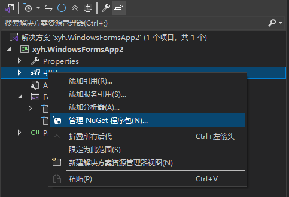
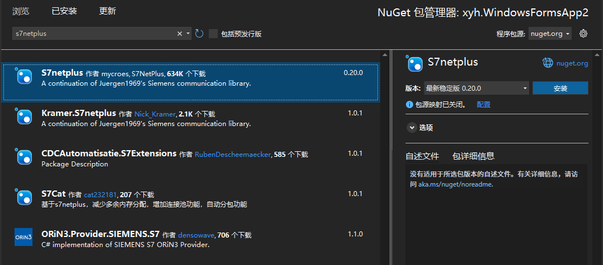

# 2.1 c#常用的基础数值类型


> Bool - >

## 枚举类型

```c#
    public enum DataType
    {
            Bool,  # 默认值从0 开始
            SByte,
            Byte,
            Short,
            UShort,
            Int,
            UInt,
            Long,
            ULong,
            Double,
            String
    }
```

# 2.2 c#常用的基础引用类型

- 所有值类型的数组

- 类对象

- 接口委托对象

- 字符串也是一种也是特殊的引用类型

- Object所有类的父类

# 2.3 数列类型转换与拆箱装箱

## 拆箱

将引用类型转换成值类型的过程

## 装箱

将值类型转换成引用类型的过程

```c#
int a = 10;
object o = a;// 装箱
int b = (int)o; // 拆箱
```

```c#
 private void button1_Click(object sender, EventArgs e)
 {
     Button b1 = (Button)sender;
     MessageBox.Show(b1.Text);
 }
```


# 2.4 常量变量定义与使用规范

- 成员变量 ：类的里面，方法的外面

- 局部变量 ：方法里面

- 常量： 使用const关键字 const int a = 100; 常量不可以修改

# 2.5 c#运算符之算术关系赋值

## 算数运算符

- +

- -

- *

- /

- %

- ++

- --

## 关系运算符

- <

- >

- ==

- 大于等于

- 小于等于

## 赋值运算符

- =


# 2.6 c#运算符之位逻辑条件

## 位运算

> 位运算的结果是一个整数

- & 运算  

一个字节的每一位进行运算，同为1 -->1 否则为0

```csharp
 byte c = 10;  // 00001010
 byte d = 20;  // 00010100
 int res = (int)c & d; // 00000000  0
```

- | 运算

一个字节和每一位进行运算，同为0-->0 否则为1 

```csharp
byte c = 10;  // 00001010
byte d = 20;  // 00010100
int res = (int)c | d; // 00011110   30
```

-  ~ 取反

```csharp
   byte e = 10; // 00001010
   byte res =(byte)~e;// 11110101 -->24
```

## 逻辑运算

- &  与

- |  或

- ！ 非

## 条件运算符（三目）

```csharp
int a =10;
int b = 20;
int res = a > b ? a:b;

```


# 2.7 字符串及字符串格式方法

- +号拼接

```csharp
  string a = "hello ";
  a += "world";
```

- StringBulid

```csharp
StringBuilder sb = new StringBuilder();
sb.Append("hello");
sb.Append(" ");
sb.Append("world");
```

- 格式化

```csharp
string c = "{0} world {1}";
string res = string.Format(c, "hello" , "java");
MessageBox.Show(res);
```

- $ 占位

```csharp
int score = 99;
string s = $"小明考了{score}分";
```

# 2.8 数值类型之间的自动转换

小的数据类型会自动转换成大 的数据类型

```csharp
int a = 10;
double c = 200;
double = a+c; // a+c 自动会转换成double
```

# 2.9 数据类型之间的强制转换

```csharp
int a = 10;
double b = 20;
int c = a+b; // 不对，需要强制类型转换

int c = (int)a+b; // 不是四舍五入 而是直接舍弃掉
```

# 2.10 字符串和数值类型之间的相互转换

```csharp
int a = 123;
string b = a.ToString();


string a = "123";
int b = int.Parse(a);
```

## 万能转换器

```csharp
string a = "123";
int v = Convert.ToInt32(a);

int  b = 123;
int c = Convert.ToString(b);
```

# 2.11 Nuget安装及西门子PLC通信





## 1. 添加命名空间

`using S7.Net;`

## 2. 创建一个西门子PLC通信对象

```csharp
Plc siemens = new Plc(CpuType.S71500,"192.168.1.152",0,0);

// 建立链接
siemens.Open();

// 读取变量（装箱）
Object value = siemens.Read("M200.0");

// 解析(拆箱)
bool res =(bool)value;
```
