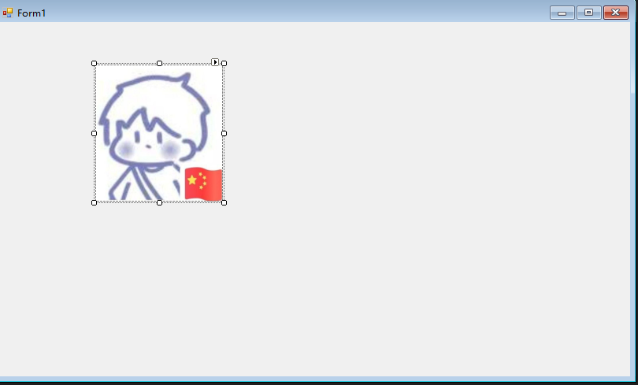
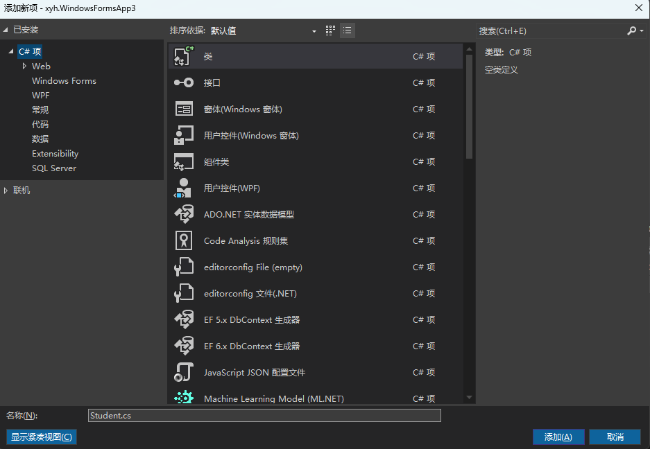

# 3.1 C#语句结构之分支结构

## if

点击图片实现切换



```csharp
    bool status = true;
    private void pictureBox1_Click(object sender, EventArgs e)
    {

        if (status)
        {
            // 切换资源文件为 avatar
            this.P_Box.Image = Properties.Resources.avatar;
        }
        else { 
            this.P_Box.Image = Properties.Resources.p_1;
        }

        status = !status;

    }
```

# 3.2 c#语句结构之循环语句

## while

```csharp
  int sum = 0;
  int i = 1;
  while (i <=100) {
      sum += i;
      i++;
  }
```

## for

```csharp
  int sum = 0;
  for (int i=1; i<=100;i++)
  {
      sum += i;
  }
```

## foreach

```csharp
   ArrayList   arr = new ArrayList();
   for (int i =1; i <= 100; i++) { 
       arr.Add(i);
   }
   int sum = 0;
   foreach (int i in arr) { 
       sum+= i;
   }
```

## dowhile

```csharp
            int sum = 0;
            int i = 1;
            do
            {
                sum += i;
                i++;
            }
            while (i<=100);
```

# 3.3 c#语法结构之跳转语句

## continue

只输出1-100的奇数

```csharp
        for (int i = 1; i<=100;i++) {
            if (i%2 ==1) {
                continue;
            }
            Console.WriteLine(i);
        }
```

## break

遇到88结束程序

```csharp
    for (int i = 1; i<=100;i++) {
            if (i ==88) {
                break;
            }
            Console.WriteLine(i);
```

# 3.4 类的定义及类的组织成员

## 1. 创建一个类



internal  : 当前程序集可用

public： 公开

## 2. 构造一个类

```csharp
    internal class Student
    {
     
        // 构造函数
        public Student() { }
        // 构造函数重载
        public Student(string name) {
            this.Name= name;
        }
        // 成员属性
        private string IDictionary { get; set; }
        private string Name { get; set; }
        private int Age{ get; set; }

        // 成员方法
        public void sleep() {
            string res = $"{this.Name}正在睡觉";
            Console.WriteLine(res); 
        }

    }
```

# 3.5 剖析属性原理及其分类

## 范围

- public 在类的外面也可以使用当前字段

- private 只有在当前类中可以使用

## 实例

一般来说我会将属性私有化，并且给他提供两个方法，一个get 一个set

```csharp
   private int myVar;

   public int MyProperty
   {
       get { return myVar; }
       set { myVar = value; }
   }
```

我们也可以使用简化写法

```csharp
private  int MyVar{get;set;};
```

# 3.6 字段与属性对比总结

- 字段一般对内，属性一般对外

- 字段一般使用private 

- 属性一般使用public

- 属性可以控制只读不写，字段无法控制

- 属性可以写逻辑代码，字段不可以

# 3.7 构造函数及析构函数应用

## 快捷键

`ctor 可以快速生成构造函数`

## 构造函数的重载

 重载要求两个方法的 方法名相同，参数列表不同 （与返回值无关）

```csharp
  // 构造函数
  public Student() { }
  // 构造函数重载
  public Student(string name) {
      this.Name= name;
  }
```

# 3.8 实例方法及其重载应用

## 实例方法

通过类的对象调用方法叫做实例方法

```csharp
Student s = new Student();
s.sleep(); // 实例方法
```

## 实例方法的重载

```csharp
public void eat(){    
}


public void eat(string food){
    

}
```

# 3.9 静态方法及其使用场景

使用类名调用的方法叫静态方法

## 静态类

静态类里面必须都是静态方法

```csharp
public static class Student{
    
    public static void eat();
    public static void sleep();

}
```

# 3.10 对象初始化器的使用方法

对象初始化器是用来个对象初始化的

> 先执行构造方法 ，然后执行对象初始化器

```csharp
Student  s = new Student(){  // 这里的() 是可以去掉的
    Name = "lxx",
    Age = 20,
};
```

```csharp
Student  s = new Student("xyh" , 18){
    Name = "lxx",
    Age = 20,
};

// 最后结果也是name = lxx 年龄 = 20
```

## 构造方法和对象初始化器有什么区别

- 构造方法中可以写代码逻辑而对象初始化器只能给属性赋值，可以给字段赋值（一般不用），不能调用方法

- 构造方法初始化必须严格按照构造方法的的参数数量和顺序

- 对象初始化器比较灵活，可以全部赋值，而且和顺序没有关系

# 3.11 断点调试及代码执行顺序

# 3.12 ref与out关键字使用说明

- 

# 3.12 PLC功能块与c#概念对比

# 3.13 PLC定时器与c#定时器

# 3.14c# 实现PLC起保停控制
