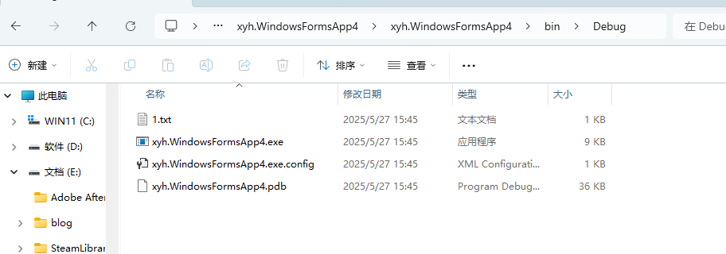
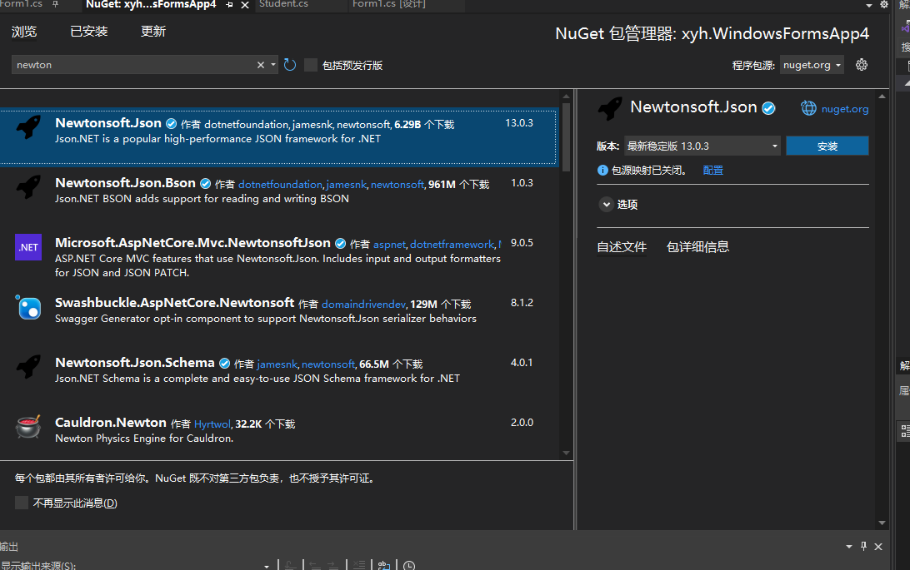

# 4.1 数组定义使用与注意事项

## 定义

数组表示同一种数据类型的连续区域

申明数组 `int[] arr;`

分配空间 `arr = new int[5]`

给数组赋值`arr[0] = 100`

使用数组`arr[0]`

## 数组的简化写法

`int[] arr = new int[3]{10,20,30};`

`int[] arr = new int[]{10,20,30};`

`int[] arr = {10,20,30};`

> 数组在使用前是一定要确定长度的

# 4.2 for循环使用及断点调试


# 4.3 foreach循环使用及断点使用


# 4.4 while循环使用及断点调试

# 4.5 泛型集合list定义和使用

## 定义

`List<int> l = new List<int>();`

> list和数组的最大区别 数组是固定长度，list可变长度

## 新增

`l.Add(1)`

`l.AddRange(new List<int>{1，2，3});`

## 删除

`l.RemoveAt(0) 根据元素索引删除`

`l.Remove(1) 根据元素删除`

`l.removeAll() 删除所有满足条件的元素`

`l.Clear() 清空`

## 修改

`l[0] = 100`

## 查询

`l[0]`

## 数组和集合的相互转换

```csharp
         List<int> arr = new List<int>() { 10,20,30 };
         int[] a = arr.ToArray();   // 将集合变成数组
         a.ToList(); // 将数组转换成集合
```

# 4.6 泛型集合List对象类型使用

- 新建一个Student类

```csharp
namespace xyh.WindowsFormsApp4
{
    public class Student
    {
        private string Name { get; set; }
        private int Age { get; set; }

    }
}
```

- 使用泛型

```csharp
          List<Student> arr = new List<Student>();
          arr.Add(new Student("xyh",20));
          arr.Add(new Student("lxx", 30));
```

# 4.7 Dictionary字典使用说明

## 定义

字典是key->value 的映射

` Dictionary<Student,int> arr = new Dictionary<Student, int>();`

## 使用

```csharp
     Dictionary<Student,int> arr = new Dictionary<Student, int>();
     arr.Add(new Student("lxx" ,10), 1); 
     arr.Add(new Student("xyh", 20), 2);
```

```csharp
    Dictionary<Student, int> arr = new Dictionary<Student, int>()
    {
        [new Student("lxx", 10)] = 1,
        [new Student("xyh", 20)] = 2

 };
   使用对象初始化器初始化字典
```

## 查找

```csharp
       Dictionary<string, int> arr = new Dictionary<string, int>()
       {
           ["xyh"] = 1,
           ["lxx"] = 2
       };

       if (arr.ContainsKey("lxx")) {  //判断是否包含执行的键
           int res = arr["lxx"];
       }
```

# 4.8 集合数组字典之Linq使用

```csharp
         Dictionary<string, int> arr = new Dictionary<string, int>()
         {
             ["xyh"] = 1,
             ["lxx"] = 2,
             ["zbj"] = 3
         };
         // 查找序号大于2的同学
         var li = from c in arr where c.Value >=2 select c;

         foreach (var c in li)
         {
             Console.WriteLine(c);
         }
```

```csharp
            int[] arr = { 10, 20, 40, 44, 33, 55, 11, 23, 45 };
            // 找出所有能被5整除的数字
            dynamic res = from c in arr where c%5 ==0 select c;
            foreach (int i in res) {
                Console.WriteLine(i);
            }  
```

# 4.9  文件流操作实现文件读写

## 写入文件

```csharp
            // 创建文件流 文件路径， 打开模式
            FileStream f = new FileStream("./1.txt" , FileMode.Create);
            // 创建写入器
            StreamWriter stream = new StreamWriter(f);
            // 以流的方式写入
            stream.Write("hello wolrd java");
            // 关闭写入器
            stream.Close();
            // 关闭文件流
            f.Close();
```

> 写出的文件在Debug文件目录下



> ./ 当前路径就是Debug目录

## 读取

在debug文件下创建2.txt 读取文件内容


读取内容

```csharp
     // 创建文件流
     FileStream f = new FileStream("./2.txt",FileMode.Open);
     // 创建读入器
     StreamReader sr = new StreamReader(f);
     // 读取一行字符
     string res = sr.ReadLine();
     Console.WriteLine(res); 
     // 关闭读入器
     sr.Close();
     // 关闭文件流
     f.Close();
```

# 4.10 异常捕获try-catch使用

  

```csharp
       FileStream f = null ;
       StreamReader sr = null;
       try
       {
           // 创建文件流
            f = new FileStream("./2.txt", FileMode.Open);
           // 创建读入器
            sr = new StreamReader(f);
           // 读取一行字符
           string res = sr.ReadToEnd();
           Console.WriteLine(res);

       }
       catch (Exception ex)
       {
           MessageBox.Show(ex.Message);
       }
       finally
       {
           // 关闭读入器
           if (sr != null) sr.Close();
           // 关闭文件流
           if (f != null) f.Close();

       }
```

# 4.11 二进制序列化实现对象存取

## 类可序列化

我们要保证我们的类是可以序列化的

在类的上面加上Serializable 


## 序列化

```csharp
       // 序列化
       Student s1 = new Student("xyh" ,12);
       FileStream f = new FileStream("./student.txt" , FileMode.Create);
       BinaryFormatter bf = new BinaryFormatter();
       try
       {
           bf.Serialize(f, s1);
       }
       catch (Exception e)
       {
           MessageBox.Show(e.ToString());
       }
       finally { 
       f.Close();
       }
```

## 反序列化

```csharp
  // 反序列化
  FileStream f2 = new FileStream("./student.txt", FileMode.Open);
  BinaryFormatter bf2 = new BinaryFormatter();
  Student s2 = null;
  try
  {
       s2 = (Student)bf2.Deserialize(f2);
  }
  catch (Exception e)
  {
      MessageBox.Show(e.ToString());
  }
  finally
  {
      f2.Close();
  }
```

# 4.12 XML序列化实现对象存取

参考上诉对象序列化只是将`BinaryFormatte` 改成`XmlSerializer`

# 4.13 Json序列化实现对象存储

## 1. 库安装

我们要安装一下`newton`库



## 引用库

`using Newtonsoft.Json;`

## 序列化对象

```csharp
       //// 序列化
       Student s1 = new Student("xyh", 12);
       FileStream f = new FileStream("./student.txt", FileMode.Create);
       StreamWriter swriter = new StreamWriter(f);
       try
       {
           string s = JsonConvert.SerializeObject(s1);// 返回一个字符串
           swriter.Write(s);
       }
       catch (Exception e)
       {
           MessageBox.Show(e.ToString());
       }
       finally
       {
           swriter.Close();
           f.Close();
       }
```

## 反序列化

```csharp
    // 反序列化
    FileStream f2 = new FileStream("./student.txt", FileMode.Open);
    Student s2 = null;
    try
    {
        StreamReader sr = new StreamReader(f2); 
        string stu_str = sr.ReadToEnd();
        s2 = JsonConvert.DeserializeObject<Student>(stu_str);
    }
    catch (Exception e)
    {
        MessageBox.Show(e.ToString());
    }
    finally
    {
        f2.Close();
    }
    MessageBox.Show(s2.Name);
```

# 4.14 泛型类和泛型方法的使用

## 泛型类

```csharp
  public class MyArray<T> { 
          private T[] array; //内部维护一个数组
          private int size;

      public MyArray(){
          this.size = 10; // 数组默认是10个长度
          array = new T[this.size];
       }

      public MyArray(int size)
      {
          this.size = size; // 数组默认是10个长度
          array = new T[size];
      }


      public void  SetArray(int index , T o) {
          array[index] = o;
      }

      public T GetArray(int index) {
          return array[index];
          }
  }
```

```csharp
       InitializeComponent();
       MyArray<int> array = new MyArray<int>();
       array.SetArray(0, 10);
       array.SetArray(1, 11);
       array.SetArray(2, 12);

       for (int i =0; i<3; i++) {
           Console.WriteLine(array.GetArray(i));
       }
```

## 泛型方法

```csharp
       public void Swap<T>(ref T a , ref T b ) { 
           T c = a;
           a = b;
           b = c;
       }
```

```csharp
    long a = 10;
    long b = 200;
    Swap(ref a, ref b);
    Console.WriteLine(a + "   " + b);
```

# 4.15 OperateResu lt类源码分析

## 简介

OperateResult是一个通用的返回结果类

在C#中使用 `OperateResult` 类，通常需要通过 HslCommunication 库来实现。以下是使用 `OperateResult` 的基本步骤和所需依赖项：
