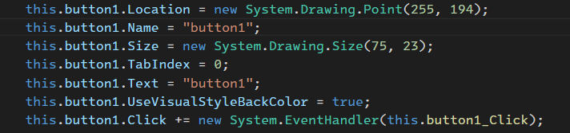

# 5.1 Windows窗体及Partial部分类

## 修改窗体名称

右击重命名，或者f2


## 属性

- Size： 窗口大小

- StartPosition:  窗口启动位置

- icon图标

- MaximinBox: 最大化按钮

- TopMost： 是否显示在最前面

> 一个窗口是由三个窗口组成
> 
> - FrmMain.cs     : 事件，逻辑等等
> 
> - FrmMain.Designer.cs ：界面，更多的是界面中元素的样式：颜色位置，大小等等


我们发现这两个类都是一样的名字，但是最后编译的时候会给他编译成一个类，我们需要用partial关键字修饰

# 5.2 通过代码创建控件深入理解

- 运行Run入口


- 执行FrmMain构造函数中的InitializeComponent() 初始化组件方法


- InitializeComponent() 其实就是在FrmMain.Designer这个类里面


## 一个按钮的过程

- 我们会在 FrmMain.Designer这个类的最下面对这个类进行定义


- 接着在InitializeComponent（） 方法中对它进行实例化


- 接着对他做一系列的初始化设置



- 最后把按钮添加到容器中


## 尝试手动编写一个按钮组件


```csharp
       {
           InitializeComponent();
           // 1. 创建一个按钮
           Button button = new Button();
           // 2. 设置属性
           button.Text = "编码按钮";
           button.Size = new Size(100,200);// 宽度，高度
           // 3. 添加到容器中
           this.Controls.Add(button);

       }
```

# 5.3 程序事件机制剖析

>  任何一个事件都有默认事件，方便我们快速使用,以按钮距离，默认是click事件

## 重置事件

- 找到对于的方法，并右击重置


- 重置只是解除绑定，在FrmMain中的方法还是存在的，我们需要把他也删除掉


## 默认事件

- 我们可以看到控件都会有一个默认事件就是click


- 我们是可以修改默认事件的，比如Form控件就修改了默认事件


# 5.4 窗体无边框拖动的两个方法

## 1. 绑定事件

可以使用任何一个控件给他绑定MouseDown和MouseMove事件


```csharp
        private Point mPoint;
        private void Panel_MouseDown(Object sender, MouseEventArgs e) {
            mPoint = new Point(e.X, e.Y);
        }

        private void Panel_MouseMove(Object sender, MouseEventArgs e) {
            if (e.Button  == MouseButtons.Left) { 
                this.Location= new Point(this.Location.X+e.X, this.Location.Y+e.Y- mPoint.Y);
            }
        }
```

# 5.6 ModBusRTU通信案例界面设计

## 设计页面


## 模拟窗口

- 打开vspd 添加一对虚拟串口


- 使用slave 模拟一个真实硬件


- 改成输入线圈，并且地址改成0-8


- 新建第二个 模拟输出线圈，0-8


# 5.7 控件tag的引用和使用场景

## 开源的modbus通信库 NModbus4


`using Modbus.Device;`

## 建立连接

当点击建立连接是我们需要做的事情

- 实例化串口通信对象

- 打开串口

- 实时通信

```csharp

   // 建立连接
   private ModbusSerialMaster master;// Modbus串口通信对象

   private SerialParam SerialParam = null; // 串口通信参数

   private void btn_connect_Click(object sender, EventArgs e)
{
    // 实例化串口通信对象
     serialPort = new SerialPort();
    serialPort.PortName = this.SerialParam.PortName;
    serialPort.BaudRate = this.SerialParam.BaudRate;
    serialPort.DataBits = this.SerialParam.DataBits;
    serialPort.Parity = this.SerialParam.Parity;
    serialPort.StopBits = this.SerialParam.StopBits;
    try {
        // 串口对象打开
        serialPort.Open();
        // 实时通信
        this.read_Time.Enabled = true; // 打开定时器
    }
    catch (Exception ex) {
        MessageBox.Show("串口打开失败" + ex.Message.ToString());
    }
    this.master = ModbusSerialMaster.CreateRtu(serialPort);

}
```

- 我们在实例化串口对象是可以将串口参数封装成一个类

```csharp
namespace xyh.WindowsFormsApp5
{
    public class SerialParam
    {

        public string PortName { get; set; }

        public int BaudRate { get; set; }

        public Parity Parity { get; set; }

        public int DataBits { get; set; }

        public StopBits StopBits { get; set; }
    }
}
```

- 在构造方法中获取参数

```csharp
       public FrmIOCard()
       {
           InitializeComponent();
           // 读取通信配置文件
           SerialParam = new SerialParam()
           {
               PortName = "COM20",
               BaudRate = 9600,
               Parity = Parity.None,
               DataBits = 8,
               StopBits = StopBits.One
           };

       }
```

## 断开连接

```csharp
   private void ben_DisConn_Click(object sender, EventArgs e)
   {

       serialPort?.Close();
}
```

## 实时通信

我们在页面中加上一个Timer，定时器


- 将间隔时间改成1s


- 设置定时器需要执行的内容


```csharp
     private void read_Time_Tick(object sender, EventArgs e)
     {
         // 先读取输入线圈
         bool[] input =  this.mast.ReadInputsils(1, 0, 8); // 读取1区从0开始8个位 

     }
```

> 我们读取到的8个线圈的数据该怎么在屏幕上展示出来呢？


- 这里我们使用tag，对每个输入位进行标记，从快速将获取到的数据与界面绑定


- 将tag从0-7 编上序号


# 5.8 容器控件遍历与实时更新

## 获取输入线圈值

```csharp
         // 先读取输入线圈
         bool[] input =  this.master.ReadInputs(1, 0, 8); // 读取1区从0开始8个位 

         if (input.Length == 8) {
         // 更新控件
         foreach(var i in this.Panel_input.Controls.OfType<Label>())
             {
                 if (i.Tag != null && i.Tag.ToString().Length > 0)
                 { // 确保tag不是null，并且不是空字符串
                     int index = Convert.ToInt32(i.Tag.ToString()); // 获取序号
                     i.BackColor = input[index] ? Color.Lime : Color.Red;// 根据信号修改当前背景颜色

                 }

             }

         }
```

## 获取输出线圈值

```csharp
  // 先读取输出线圈
  bool[] output = this.master.ReadCoils(1, 0, 8); // 读取1区从0开始8个位 

  if (output.Length == 8)
  {
      // 更新控件
      foreach (var i in this.Panel_Output.Controls.OfType<Label>())
      {
          if (i.Tag != null && i.Tag.ToString().Length > 0)
          { // 确保tag不是null，并且不是空字符串
              int index = Convert.ToInt32(i.Tag.ToString()); // 获取序号
              i.BackColor = output[index] ? Color.Lime : Color.Red;// 根据信号修改当前背景颜色

          }

      }

  }
```

# 5.9事件参数sender的使用说明

我们要通过点击面板上的信号值去修改我们的硬件信号

- 我们要给所有的输入label一个共同的点击方法


```csharp
    private void comment_label_click(object sender, EventArgs e)
    {
        if (sender is Label)
        {
            Label label = (Label)sender;

            if (label.Tag != null && label.Tag.ToString().Length > 0)
            {

                int index = Convert.ToInt32(label.Tag);
                // 取反写入
                bool write_color = label.BackColor == Color.Red ? true : false;
                this.master.WriteSingleCoil(1, (ushort)index, write_color);

            }


        }

    }
```

> 我们怎么知道到底是哪一个被点击了呢？

sender对象其实就是当前触发这个方法的对象，我们将它转换成label并且，将值取反写入到模拟软件中


# 5.10 基于构造函数实现参数配置

- 绘制参数界面


- 给下拉菜单新增选项

```csharp
  this.cmb_PortName.Items.AddRange(SerialPort.GetPortNames());
  this.Cmb_BaudRate.Items.Add("9600");
  this.Cmb_BaudRate.Items.Add("19200");
  this.Cmb_BaudRate.Items.Add("38400");
  this.Cmb_Parity.DataSource = Enum.GetNames(typeof(Parity));
  this.Cmb_DataBits.Items.AddRange(new string[] { "7", "8" });
  this.Cmb_StopBits.DataSource = Enum.GetNames(typeof(StopBits));
```

- 通过构造方法将配置传递过来

```csharp
        public FrmCommSet(SerialParam serialParam,string path)
        {
            InitializeComponent();

            // 先将传递过来的对象保存一下
            this.serialParam = serialParam;
            this.path = path;
            // 初始化下拉菜单
            this.cmb_PortName.Items.AddRange(SerialPort.GetPortNames());
            this.Cmb_BaudRate.Items.Add("9600");
            this.Cmb_BaudRate.Items.Add("19200");
            this.Cmb_BaudRate.Items.Add("38400");
            this.Cmb_Parity.DataSource = Enum.GetNames(typeof(Parity));
            this.Cmb_DataBits.Items.AddRange(new string[] { "7", "8" });
            this.Cmb_StopBits.DataSource = Enum.GetNames(typeof(StopBits));

            // 赋值
            this.cmb_PortName.Text = serialParam.PortName;
            this.Cmb_BaudRate.Text = serialParam.BaudRate.ToString();
            this.Cmb_Parity.Text = serialParam.Parity.ToString();
            this.Cmb_DataBits.Text = serialParam.DataBits.ToString();
            this.Cmb_StopBits.Text = serialParam.StopBits.ToString();

        }
```

-  确定设置时，将参数对象实例化到本地

```csharp
    // 确认设置的时候保存对象
    private void btn_ok_Click(object sender, EventArgs e)
    {
            // 修改对象
            this.serialParam.PortName = this.cmb_PortName.Text;
            this.serialParam.BaudRate = Convert.ToInt32(this.Cmb_BaudRate.Text) ;
            this.serialParam.DataBits = Convert.ToInt32(this.Cmb_DataBits.Text);
            this.serialParam.Parity = (Parity)Enum.Parse(typeof(Parity), this.Cmb_Parity.Text,true);
            this.serialParam.StopBits = (StopBits)Enum.Parse(typeof(StopBits), this.Cmb_StopBits.Text, true);
                // 将对象序列化到本地
           save_local(path , this.serialParam);
               
        this.DialogResult = DialogResult.OK;

    }
```

- 序列化方法

```csharp
     private void save_local(string path,Object o) {
         FileStream f = new FileStream(path, FileMode.Create);
         BinaryFormatter bf = new BinaryFormatter();
         try
         {
             bf.Serialize(f, o);
         }
         catch (Exception e)
         {
             MessageBox.Show(e.ToString());
         }
         finally
         {
             f.Close();
         }
     }
```

- 取消设置

```csharp
   private void btn_cancel_Click(object sender, EventArgs e)
   {
           this.DialogResult = DialogResult.Cancel;
   }
```

- 在主界面有通信设置按钮，编写通信设置逻辑

```csharp
       private void btn_CommSet_Click(object sender, EventArgs e)
       {
           FrmCommSet frmCommSet = new FrmCommSet(this.SerialParam,path);
           //frmCommSet.Show();// 没点击一次就会弹出一个窗口
           frmCommSet.ShowDialog();// 必须将弹出窗口关闭掉才可以弹出其他的

       }
```

- 读取配置文件

```csharp
        private SerialParam GetSerialParam() {

            FileStream f2 = new FileStream(path, FileMode.Open);
            BinaryFormatter bf2 = new BinaryFormatter();
            SerialParam serialParam = null;
            try
            {
                serialParam = (SerialParam)bf2.Deserialize(f2);
            }
            catch (Exception e)
            {
                MessageBox.Show(e.ToString());
            }
            finally
            {
                f2.Close();
            }
            return serialParam;


        }
```

## 字符串转枚举

> Parity= (Parity)Enum.Parse(typeof(Parity), this.Cmb_Parity.Text

# 5.11 窗体关闭及MessageBox使用
