# 7.1 结合案例引入委托应用场合

> 当窗口与窗口之间的通信基于方法没有效果的时候，可以考虑使用委托

- 有两个label 一个文字信息， 一个时间信息

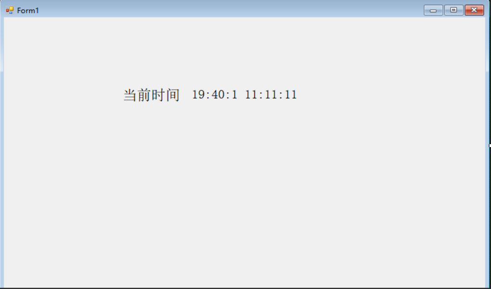

- 我们在程序运行注册一个定时器每隔一秒就获取一次时间

```csharp
   private string C_Time; //当前时间
   public Form1()
   {
       InitializeComponent();
       // 创建一个定时器 也可以是用Threading 下面的timer
       Timer timer = new Timer();
       // 定时器执行时间
       timer.Interval = 1000;
       // 注册事件
       timer.Tick += SetTime;
       // 启动定时器
       timer.Start();
   }
        private  void SetTime(object sender, EventArgs e)
     {
          // 获取时间
    DateTime currentTime = DateTime.Now;
    this.C_Time = currentTime.ToString("yyyy-MM-dd HH:mm:ss");
    this.time_label.Text = C_Time;
     }
```

- 我们在创建一个子页面，我希望这个数据也可以在子页面中展示
  
  - 子窗体中也是有两个label 一个是文字展示，一个是显示时间

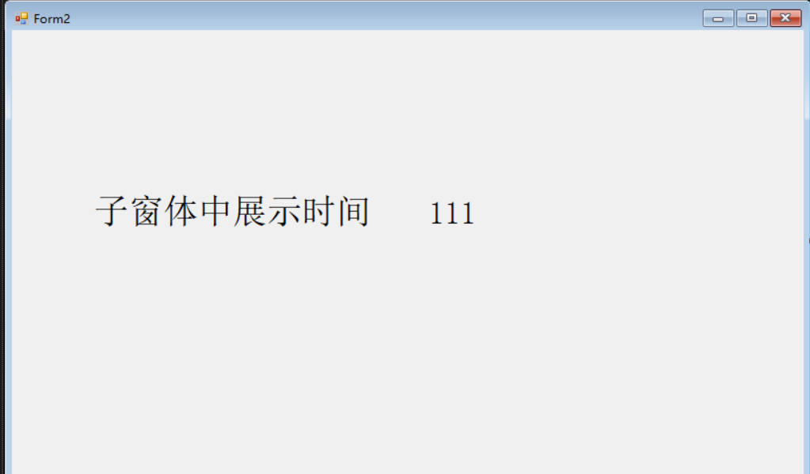

- 我们在主窗口中添加一个按钮，并且给他一个单机时间，打开子窗口

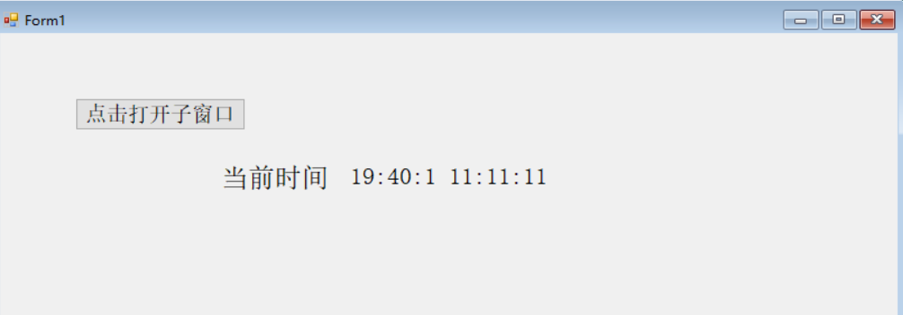

```csharp
   private void button1_Click(object sender, EventArgs e)
   {
       // 创建子窗口对象 并将值传递
       Form2 f = new Form2(this.C_Time);
       // 打开窗口
       f.Show();
   }
```

- 在子窗口中接收数据，并展示

```csharp
     public Form2(string time)
     {
         // 初始化组件
         InitializeComponent();
         this.label2.Text = time;

     }
```

> 最后我们发现子窗口中的时间并没有动态变化，只是一个静态数据，如果我们希望我们的数据也可以像主窗口一样动起来，可以使用委托

# 7.2 经典委托Delegate五步法

## 申明委托-类的外面

```csharp
   // 1. 申明委托 在主窗体里面
   public delegate void showChildValueDelegate(string str);
```

## 创建委托变量

> 哪里调用就在哪里创建，数据源在哪里我们就在哪里创建

```csharp
 // 2. 申明委托变量 - 就是一个变量 在主窗体里面
 private showChildValueDelegate ShowChildValue;
```

## 创建委托方法

```csharp
     //3.创建委托方法: 哪里实现就在哪里创建
     // 要让委托和委托原型保持一直(返回值和参数列表)
     public void ShowValue(string str)
     {
         this.label2.Text = str;
     }
```

## 委托变量绑定委托方法

```csharp
       //4.委托变量绑定委托方法：在一个可以同时拿到委托变量和委托方法的地方绑定
       // 单播委托： 一个委托变量只绑定一个委托方法
       // 多播委托： 一个委托变量需要绑定一个或多个委托方法
       this.ShowChildValue =f.ShowValue;
```

## 调用委托

```csharp
     private  void SetTime(object sender, EventArgs e)
     {
         // 获取时间
         DateTime currentTime = DateTime.Now;
         this.C_Time = currentTime.ToString("yyyy-MM-dd HH:mm:ss");
         this.time_label.Text = C_Time;

         // 5.调用委托 如果只调用一次的话我们可以随意找一个地方调用
         // 如果调用多次的话可以放在定时函数中
         if (this.ShowChildValue != null) {
             this.ShowChildValue(C_Time);
         }

     }
```

# 7.3 委托的遍历和删除

    ` this.ShowChildValue +=f.ShowValue;` 

当我们帮绑定的= 换成+=时，每一次我们点击 打开子窗口按钮是就会把这个方法绑定一次，当我们多次点击之后，就会绑定很多次这个方法，从而影响速度

- 我们可以通过委托遍历查看当前委托变量绑定的委托方法

```csharp
      // 委托遍历   GetInvocationList按照调用顺序返回此多路广播委托的调用列表。
      Delegate[] a = ShowChildValue.GetInvocationList();
      for (int i =0;i <a.Length;i++)
      {
          // 获取方法
         MethodInfo method = a[i].Method;
      }
```

- 我们可以使用委托删除解决这个问题

` this.ShowChildValue = null;` 委托删除其实就是把委托变量在每次赋值之前改成null

# 7.4 基于委托实现子窗体传值

就是将子窗体中的值传到主窗体中，实现方法如上基于委托的5步法

# 7.5 多播委托传值多个子窗体

- 我们可以看到当我再次点击打开子窗口的时候，我们发现第一子窗体的值不会在变化了

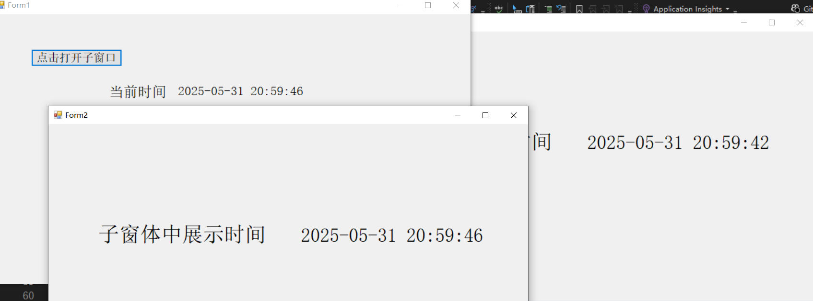

- 解决方法就是把 委托绑定时的= 换成+= 变成多播委托就可以了

# 7.6系统委托Action简化Delegate

- Action 其实就是帮我们封装好了无返回值，且最多带16个参数的委托
  
  `Action` 

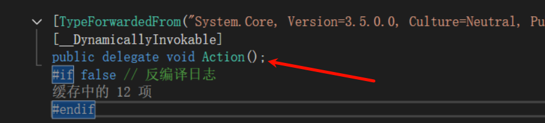

` Action<int,int>` 带两个参数的委托

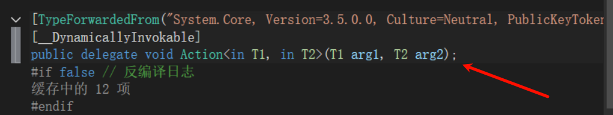

# 7.7 系统委托带返回值func应用

- Func 带有返回之的委托，且最多有9个参数

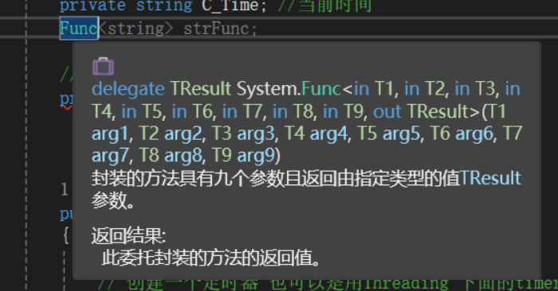

- 泛型的最后一位是返回值

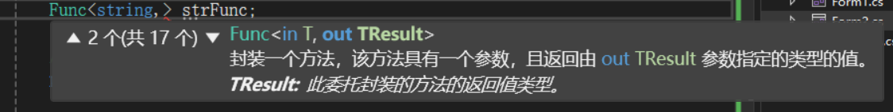

# 7.8 多线程Thread及Task应用

> 一个进程里面可以包含多个线程

- 新建一个窗体，我们使用多线程方式完成实时时间的展示

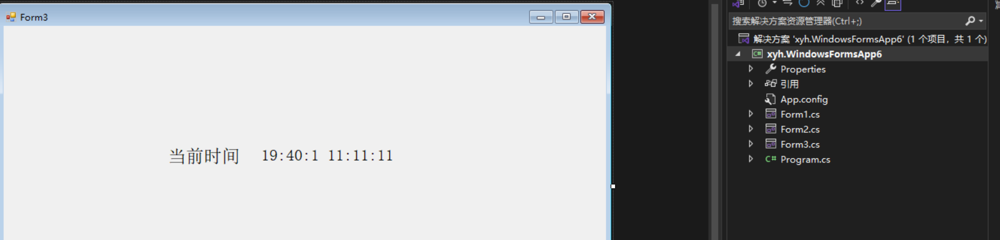

- 创建多线程

```csharp
       public Form3()
       {
           InitializeComponent();

           // 开辟一个线程,并且传入当前线程该执行的任务
           Thread thread = new Thread(getCurrentTime);
           // 设置线程模式.一般位后台线程
           thread.IsBackground = true;
           // 启动线程
           thread.Start();

       }
```

- 创建多线程调用方法

```csharp
       private void getCurrentTime() {
          // 获取当前时间
          string time = DateTime.Now.ToString();
         // 将当前时间赋值给组件
         this.time_label.Text = time;

           }
```

- 成功使用线程获取到时间

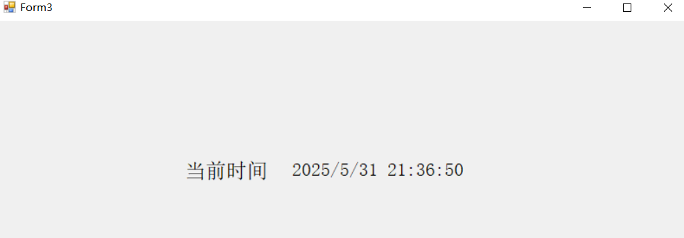

> 我这里没有出现问题，但是一般来说线程访问主线城中的组件时会报错的，我们可以通过委托完成 

没出问题可能是vs的问题，重新保存运行一下还是会报错，解决方法如下

- 使用委托完成多个线程之间的组件访问

```csharp
       private void getCurrentTime() {
          // 获取当前时间
          string time = DateTime.Now.ToString();
          // 将当前时间赋值给组件
          // 使用委托完成
          this.Invoke(new Action(() =>
          {
              this.time_label.Text = time;
          }));
        }
```

- 当然目前这边线程在方法结束之后就销毁了，我们可以使用循环不断的获取时间

```csharp
     private void getCurrentTime() {
        while (true)
        {
            // 获取当前时间
            string time = DateTime.Now.ToString();
            Thread.Sleep(1000);
        // 将当前时间赋值给组件
        // 使用委托完成
        this.Invoke(new Action(() => {
            this.time_label.Text = time;
        }));

    }
```

## Task

Task开始线程的3种方式

```csharp
//1. task默认就是后台程序
Task task = new Task(xxx);
task.Start();
//2. 
 Task.Run(new Action(() =>
 {
    getCurrentTime(); 
 }));
// 3
 Task.Factory.StartNew(new Action(() =>
 {
     getCurrentTime();
 }));
```

- 在run方法中我们还可以传入第二个参数，是一个取消标记，我们可以通过这个标记控制当前任务是否执行

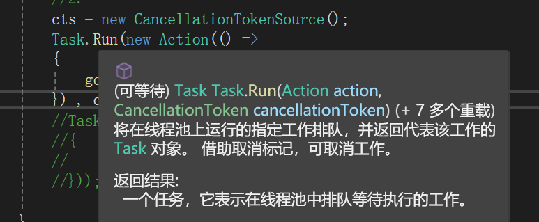

```csharp
 private CancellationTokenSource cts;
  cts = new CancellationTokenSource();
 Task.Run(new Action(() =>
 {
     getCurrentTime();
 }) , cts.Token);
```

- 我们可以通过IsCancellationRequested控制任务是否被取消，默认是false

```csharp
private void getCurrentTime() {

    while (!cts.IsCancellationRequested) // 想要控制是否展示 
    {
        // 获取当前时间
        string time = DateTime.Now.ToString();
        Thread.Sleep(1000);
    // 将当前时间赋值给组件
    // 使用委托完成
    this.Invoke(new Action(() => {
        this.time_label.Text = time;
    }));

}
```

- 我们可以在窗口关闭的时候将当前这个任务取消掉

```csharp
  private void Form3_FormClosing(object sender, FormClosingEventArgs e)
  {
      if (this.cts!= null) {
          this.cts.Cancel(); // 将标记设为取消
      }
  }
```

# 7.9 Invoke两种不同应用场景

- 控件调用invoke实现多线程中获取数据（参考上面label获取时间）

- 委托调用时，可以直接调用委托变量，也可以使用invoke

```csharp
  // 5.调用委托 如果只调用一次的话我们可以随意找一个地方调用
         // 如果调用多次的话可以放在定时函数中
         if (this.ShowChildValue != null) {
             this.ShowChildValue(C_Time);
             this.ShowChildValue.invoke(C_Time); 
         }
```

# 7.10 多线程的启动停止暂停继续

- 绘制界面

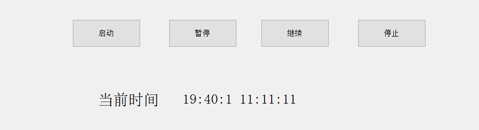

- 启动

```csharp
      private void btn_start_Click(object sender, EventArgs e)
      {
          cts = new CancellationTokenSource();
          Task.Run(new Action(() =>
          {
              getCurrentTime();
          }), cts.Token);
      }
```

- 停止

```csharp
  private void btn_stop_Click(object sender, EventArgs e)
  {
      cts?.Cancel();
  }
```

- 暂停

```csharp
 private void btn_pause_Click(object sender, EventArgs e)
 {
     ManualResetEvent.Reset();
 }
```

- 继续

```csharp
 private void btn_continue_Click(object sender, EventArgs e)
 {
     ManualResetEvent.Set();
 }
```

> 暂停和继续的话我们需要用到一个ManualResetEvent类，用来控制当前线程是否暂停和启动

`private ManualResetEvent ManualResetEvent = new ManualResetEvent(true);`

默认是启动状态,我们把当前信号放在任务中，其实就是对当前线程的一个阻塞

```csharp
        private void getCurrentTime() {

            while (!cts.IsCancellationRequested) // 想要控制是否展示 
            {
                // true就是放行 false就是阻塞
                ManualResetEvent.WaitOne();
                // 获取当前时间
                string time = DateTime.Now.ToString();
                Thread.Sleep(1000);
            // 将当前时间赋值给组件
            // 使用委托完成
            this.Invoke(new Action(() => {
                this.time_label.Text = time;
            }));

        }
```
