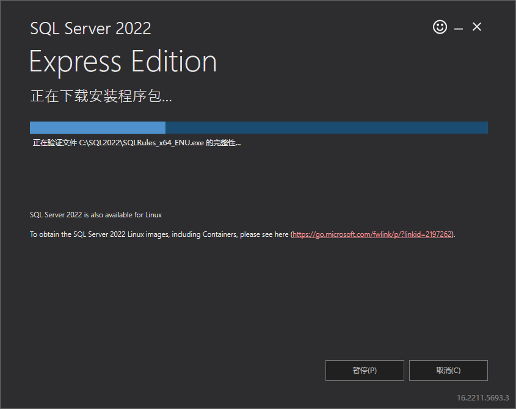

# SqlServer2022安装

## 下载

- [SQL Server 下载 | Microsoft](https://www.microsoft.com/zh-cn/sql-server/sql-server-downloads)


我们下载这个免费版本就可以了

## 安装


- 点击接受


- 最好就是默认安装位置


- 等待安装过程



- 安装完成


> 默认的实例名称就是SQLEXPRESS

- 安装ssms


- 在新弹出的页面中找到下载，并下载（云盘里有18.2 的安装包，直接安装一下）


# 9.2 SQL数据的两种登录方式

## 1. windows身份认证


## 2. sa账号认证

- 我们要先打开sql server认证模式


- 将sa状态设置


- 修改sa登录密码


- 重启服务


- 再次启动使用sa账号登录


# 9.3 客户端远程登录说明

使用ip地址登录


# 9.4  SqlServer实现创建数据库

> 创建数据库指定的filename中的路径一定要存在不然会报错

```sql
use master

go

/*
创建数据库之前判断是否已经存在
*/
if exists(select * from sysdatabases where name = 'MyFirstDB')

drop database MyFirstDB

go

/*
创建数据库
*/

create database MyFirstDB
on primary(
    name= 'MyFirstDB_data',  -- 数据库文件名称
    filename='D:\\data\\MyFirstDB_data.mdf', -- 指向的文件
    size=100MB,        -- 数据库大小
    filegrowth=50MB  -- 自动扩容大小
)
log on(

    name = 'MyFirstDB_log',
    filename='D:\\data\\MyFirstDB_data.ldf',
    size=10MB,
    filegrowth=5MB
)
go
```

# 9.5 SqlServer数据类型及数据约束

## 字符串类型

### 单字节：中文占2个字节，英文占一个字节

- char       ： 固定长度最大8000

- varchar： 可变长度最大8000

- text ： 最多20亿

### 双字节：中文占2个字节，英文占2个字节

- nchar

- nvarchar

- ntext

## 布尔类型

- bit 单个布尔

## 二进制

- binary ： 固定长度二进制

- varbinary：可变长度二进制 

- image ： 专门用来存储图片音频

## 整形

- tinyint                byte

- smallint              short

- int                       int

- bigint                  long

## 精确浮点数

- decimal

- numberic

## 近似浮点数

- float ： 小数点15为

- real ： 小数点7位

## 日期时间

- datatime :精确到3/100秒

- smalldatetime: 精确到1分钟

- date

- time

## 数据约束

- 检查约束

- 非空约束

- 主键约束

- 外键约束

- 唯一约束

# 基于T-SQL创建数据库表

```sql
use MyFirstDB
-- 创建角色表
if exists(select * from sysobjects where name ='UserRole')
drop table UserRole

go
create table UserRole(
    RoleId int identity(10000,1)  primary key, -- identity(10000,1)  自增列 从10000开始，每次加1
    RoleName varchar(100) not null,
)

-- 创建用户表
if exists(select * from sysobjects where name ='SysAdmin')
drop table SysAdmin

go
-- 创建数据表
create table SysAdmin(
    LoginId int identity(10000,1)  primary key, -- identity(10000,1)  自增列 从10000开始，每次加1
    LoginName varchar(100) not null,
    LoginPwd varchar(100)not null,
    RoleId int references UserRole(RoleId) -- 角色id
)
```

# 9.7 增删改查SQL语句使用说明

```sql
-- 插入数据
insert into UserRole(RoleName) values('管理员')
insert into SysAdmin(LoginName,LoginPwd,RoleId) values('张三','123',10000)

-- 查询数据
select * from SysAdmin

-- 删除数据
delete  from  SysAdmin where  LoginId = 10002

-- 修改数据
update  SysAdmin  set LoginName = '李四' where LoginId = 10003 
```

# 9.8 默认命名实例及连接字符串

## 连接字符串

- 基于sa账户： serevr databaes uid pwd

> string connstr = "server=XUXIAOYUN\SQLEXPRESS;Database=MyFirstDB;Uid=sa;Pwd=123456"

这个server可以从ssms中复制过来 

> server 其实就是 ip地址/实例名称


- 基于server连接： 计算机名\实例名

- 计算机名： 127.0.0.1 或者 . 或者 localhost

## 使用c#连接

```csharp
 public partial class Form1 : Form
 {

     private string ConnStr = "Server=localhost\\SQLEXPRESS;Database=MyFirstDB;Uid=sa;Pwd=123456";
     public Form1()
     {
         InitializeComponent();
         // 连接数据库
         SqlConnection sqlConn = new SqlConnection();
         sqlConn.ConnectionString = ConnStr;
         sqlConn.Open();
         MessageBox.Show(sqlConn.State.ToString());
     }
 }
```

# 9.9c#  联合SQLServer增加删除

- 绘制界面


- 编写添加事件

```csharp
  // 添加用户
  private void button1_Click(object sender, EventArgs e)
  {
      // 创建连接对象
      sqlConn = new SqlConnection(ConnStr);
      // 编写sql语句
      string sql = $"insert into SysAdmin(LoginName,LoginPwd,RoleId) values('{this.text_name.Text}','{this.text_pwd.Text}',10000)";
      // 创建sqlCommand对象
      SqlCommand sqlCommand = new SqlCommand(sql, sqlConn);
      //打开连接
      sqlConn.Open();
      //执行操作
      sqlCommand.ExecuteNonQuery();// 增删改 返回值是受影响的行
      //关闭连接
      sqlConn.Close();
  }
```

# 9.10c#联合SQLServer修改查询

- 添加组件


- 编写对象

```csharp
namespace xyh.WindowsFormsApp9
{
    public class SysAdmin
    {
        public int LoginId { get; set; }

        public string LoginName { get; set; }
        public string LoginPwd { get; set; }
        public int RoleName { get; set; }
    }
}
```

- 为dataGridView添加列


- 为每一列绑定数据


- 新增查询按钮，并编写查询事件

```csharp
      // 查询列表
      private void button2_Click(object sender, EventArgs e)
      {
          // 创建连接对象
          sqlConn = new SqlConnection(ConnStr);
          // 编写sql语句
          string sql = "select LoginId,LoginName,LoginPwd,RoleId from SysAdmin";
          // 创建sqlCommand对象
          SqlCommand sqlCommand = new SqlCommand(sql, sqlConn);
          //打开连接
          sqlConn.Open();
          //执行操作
          SqlDataReader dataReader = sqlCommand.ExecuteReader();// 增删改 返回值是受影响的行
          // 解析数据

          List<SysAdmin> list = new List<SysAdmin>();
          while (dataReader.Read())
          {
              SysAdmin sysAdmin = new SysAdmin();
              sysAdmin.LoginId = Convert.ToInt32(dataReader["LoginId"]);
              sysAdmin.LoginName = Convert.ToString(dataReader["LoginName"]);
              sysAdmin.LoginPwd = Convert.ToString(dataReader["LoginPwd"]);
              sysAdmin.RoleId = Convert.ToInt32(dataReader["RoleId"]);
              list.Add(sysAdmin);
          }
          // 关闭读取器
          dataReader.Close();
          //关闭连接
          sqlConn.Close();
          // 绑定数据
          this.dataGridView1.DataSource = null;
          this.dataGridView1.DataSource = list;

      }
```


# 9.11SQLHelper与连接字符串配配置

- 在AppConfig中配置


```csharp
<connectionStrings>
	<add name="connStr" connectionString="Server=localhost\SQLEXPRESS;Database=MyFirstDB;Uid=sa;Pwd=123456"/>	
</connectionStrings>
```

> "Server=localhost\SQLEXPRES  这里一定不要写\\\ 

- 在SQLHelp类中读取配置文件

```csharp
namespace xyh.WindowsFormsApp9
{
    public class SqlHelp
    {
        public static string ConnStr = ConfigurationManager.ConnectionStrings["connStr"].ToString();
    }
}
```

> ConfigurationManager 这个类需要导入 using System.Configuration;

# SQLServer通用方法增加删除

```csharp
      /**
       *通用的增删改方法
       */

      public static int  ExeceteNoQuery(String sql) {

          // 创建连接对象
          SqlConnection sqlConn = new SqlConnection(ConnStr);
          // 编写sql语句

          // 创建sqlCommand对象
          SqlCommand sqlCommand = new SqlCommand(sql, sqlConn);
          try
          {
              //打开连接
              sqlConn.Open();
              //执行操作
             return sqlCommand.ExecuteNonQuery();// 增删改 返回值是受影响的行
          }
          catch (Exception ex) {
              // 将异常抛出去
              throw new Exception("ExceteNoQuery执行异常："+ex.Message);
          }finally {
              //关闭连接
              sqlConn.Close(); 
          }

      }
```

- 当我们查询的是数量的时候可以使用 select count(*) from SysAdmin

```csharp
        public static Object ExecuteScalar(String sql)
        {

            // 创建连接对象
            SqlConnection sqlConn = new SqlConnection(ConnStr);
            // 编写sql语句

            // 创建sqlCommand对象
            SqlCommand sqlCommand = new SqlCommand(sql, sqlConn);
            try
            {
                //打开连接
                sqlConn.Open();
                //执行操作
                return sqlCommand.ExecuteScalar();// 增删改 返回值是受影响的行
            }
            catch (Exception ex)
            {
                // 将异常抛出去
                throw new Exception("ExceteNoQuery执行异常：" + ex.Message);
            }
            finally
            {
                //关闭连接
                sqlConn.Close();
            }

        }
```

# SQLServer通用方法查询

```csharp
public static SqlDataReader sqlDataReader (String sql) {

    // 创建连接对象
    SqlConnection sqlConn = new SqlConnection(ConnStr);
    // 编写sql语句
    // 创建sqlCommand对象
    SqlCommand sqlCommand = new SqlCommand(sql, sqlConn);
    SqlDataReader dataReader = null ;
    try
    {
        //打开连接
        sqlConn.Open();
        //执行操作 CommandBehavior.CloseConnection: 当dataReader被关闭的时候会把SqlConnection也关闭
        return  sqlCommand.ExecuteReader(CommandBehavior.CloseConnection);// 增删改 返回值是受影响的行
    }
    catch (Exception e) { 
        throw new Exception ("sqlDataReader执行异常： " + e.Message);
    }

}
```

```csharp
 public static DataSet GetDataSet(string sql , string tableName = null) {
     // 创建连接对象
     SqlConnection sqlConn = new SqlConnection(ConnStr);
     // 编写sql语句
     // 创建sqlCommand对象
     SqlCommand sqlCommand = new SqlCommand(sql, sqlConn);
     SqlDataAdapter dataAdapter = new SqlDataAdapter(sqlCommand) ;
     DataSet dataSet = new DataSet();
     try
     {
         //打开连接
         sqlConn.Open();
         if (tableName == null)
         {
             dataAdapter.Fill(dataSet);
         }
         else {
             dataAdapter.Fill(dataSet, tableName);
         
         }
             //执行操作 CommandBehavior.CloseConnection: 当dataReader被关闭的时候会把SqlConnection也关闭
             return dataSet;
     }
     catch (Exception e)
     {
         throw new Exception("GetDataSet执行异常： " + e.Message);
     }

 }
```
